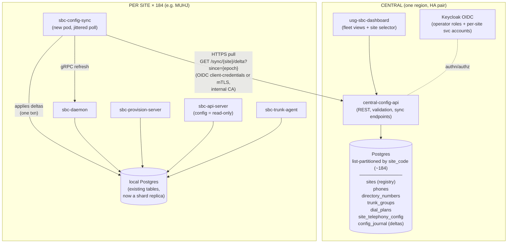

# Central Configuration Database — Design & Implementation Plan

**Status:** Draft
**Scope:** Central source of truth for phone and SBC telephony configuration
(phones, directory numbers, trunk groups, dial plans, site telephony settings)
across ~184 sites, with distributed read capability at each site.

---

## 1. Goals and non-goals

### Goals

- One authoritative, audited place to manage telephony configuration for the
  whole fleet, sharded by site code (e.g. `MUHJ`, `MPLS`, `OOPL`).
- Every site continues to provision phones, route calls, and register trunks
  with **zero dependency on WAN connectivity** for the read path
  (DDIL-tolerant: last-known-good config survives a partition of days).
- Fleet-wide visibility: "which sites are on dial plan rev N", "which phones
  run firmware X", config-staleness-by-site dashboards.
- Minimal change to the per-site SBC stack: the daemon, provision-server,
  api-server, and trunk-agent already read the in-cluster Postgres; they keep
  doing exactly that.

### Non-goals

- Distributed writes. Sites do not normally write config; the central system
  is the single writer (with a break-glass exception, §7).
- Replacing Helm for infrastructure identity. Network bootstrap config (LB
  IPs, BGP labels, zones/interfaces, TLS secrets, K8s wiring) stays in Helm
  values. Only *telephony* configuration moves to the central DB (§3).
- A geo-distributed consensus database (CockroachDB et al.). 184 sites with
  unreliable links is the wrong fit for quorum systems; the data is small and
  read-mostly.

---

## 2. Architecture overview



Key properties:

- **Pull, not push.** Each site polls the central API for deltas since its
  last applied epoch. Pull rides through flaky links, NAT, and re-seeds after
  arbitrary downtime without replication-slot management. (Lab experience:
  stale AAAA records, internal CA, intermittent reachability — long-lived
  logical-replication connections would fight all of that.)
- **The local Postgres is the distributed read capability.** No new edge
  datastore; the existing tables become a materialized copy of that site's
  shard.
- **Site code is the security boundary.** A site's credential can only fetch
  its own shard; it is structurally impossible to receive another site's rows.

---

## 3. What lives where

| Config | Today | Target | Rationale |
| --- | --- | --- | --- |
| Phones (MAC, vendor, lines, template) | Site Postgres `phones` | **Central, sharded** | Core provisioning data |
| Directory numbers / DIDs | Site Postgres `directory_numbers` | **Central, sharded** | Fleet-wide number management, E.164 uniqueness checks |
| Trunk groups + trunks | Site Postgres `trunk_groups` + Helm TOML examples | **Central, sharded** + global templates (§5.4) | Most trunks (e.g. BulkVS) are fleet-shared definitions with per-site selection |
| Dial plans | Site Postgres `dial_plans` + Helm TOML | **Central, sharded** + global templates | Same: baseline plan is fleet policy, sites get overrides |
| Site telephony settings (max_calls, codec prefs, default trunk group, voicemail URI…) | Helm `values-<site>.yaml` → TOML ConfigMap | **Central `site_telephony_config`** | Editable without a Helm rollout |
| Zones / interfaces / listen addrs, LB IPs, BGP label, fqdn_base | Helm values | **Stays in Helm** | Infrastructure identity; changes imply a deploy anyway |
| TLS certs, HMAC/auth secrets, Postgres DSNs | K8s Secrets | **Stays in K8s Secrets** | Never in the config DB |
| OIDC issuer/client config | Helm values | Stays in Helm (Phase ≥6 may centralize) | Tied to ICAM deployment, changes rarely |

Boundary rule of thumb: **if changing it should not require `helm upgrade`,
it belongs in the central DB.** If it describes *where the SBC lives on the
network*, it stays in Helm.

---

## 4. Central schema

### 4.1 Site registry (the shard list)

```sql
CREATE TABLE sites (
    site_code     text PRIMARY KEY,          -- 'MUHJ', 'MPLS', 'OOPL-001'…
    display_name  text NOT NULL,
    fqdn_base     text NOT NULL,             -- mirrors helm site.fqdn_base
    timezone      text NOT NULL,
    status        text NOT NULL DEFAULT 'planned',  -- planned|active|decommissioned
    config_epoch  bigint NOT NULL DEFAULT 0, -- monotonic, bumped on any write to this shard
    created_at    timestamptz NOT NULL DEFAULT now(),
    updated_at    timestamptz NOT NULL DEFAULT now()
);
```

Adding site #185 = insert a row + run the partition-DDL generator
(`deploy/central-db/scripts/gen-site-partitions.sh`, which diffs `sites`
against existing partitions and emits `CREATE TABLE … PARTITION OF …`).
Never hand-write partition DDL.

**Site-code canon:** canonical form is uppercase —
`^[A-Z][A-Z0-9-]{0,14}[A-Z0-9]$` (starts with a letter, ends with a letter
or digit so lowercased DNS derivations stay valid; A–Z, 0–9, hyphen; 2–16
chars). Examples: `MUHJ`,
`MPLS`, `OOPL-001`. The registry stores only the canonical form (enforced by
a CHECK constraint); lowercase derivations — DNS labels, helm `site.name`,
partition table names (`phones_p_oopl_001`) — are computed on demand, never
stored. Inputs are uppercased at the API boundary before lookup.

### 4.2 Sharded config tables

All four config tables share an envelope; payloads stay JSONB so the existing
Rust structs (`sbc-config/src/schema.rs`) keep working unmodified:

```sql
CREATE TABLE phones (
    site_code   text NOT NULL REFERENCES sites(site_code),
    id          text NOT NULL,
    mac_normalized text NOT NULL,
    data        jsonb NOT NULL,
    revision    bigint NOT NULL,             -- shard epoch at which this row last changed
    deleted     boolean NOT NULL DEFAULT false,  -- tombstone for delta sync
    updated_at  timestamptz NOT NULL DEFAULT now(),
    updated_by  text NOT NULL,               -- OIDC subject of the operator
    PRIMARY KEY (site_code, id)
) PARTITION BY LIST (site_code);

-- Partial: tombstoned phones must not block MAC reuse by a replacement.
CREATE UNIQUE INDEX idx_phones_site_mac_live
    ON phones (site_code, mac_normalized) WHERE NOT deleted;
```

`directory_numbers`, `trunk_groups`, `dial_plans`, the four CUCM routing
tables (`cucm_partitions`, `cucm_calling_search_spaces`,
`cucm_route_patterns`, `cucm_route_lists`), and `site_telephony_config`
follow the same shape (same envelope columns, existing payload formats).

Fleet-wide DID uniqueness cannot be a unique index on `directory_numbers`
itself — Postgres requires unique constraints on a partitioned table to
include the partition key. Instead, an unpartitioned `did_registry (did
PRIMARY KEY, site_code)` table is maintained by the central API in the same
transaction as every `directory_numbers` write; the primary key turns a DID
collision between two sites into a hard error.

### 4.3 Change journal (drives delta sync + audit)

```sql
CREATE TABLE config_journal (
    site_code   text NOT NULL,
    epoch       bigint NOT NULL,             -- per-site monotonic
    table_name  text NOT NULL,               -- 'phones' | 'dial_plans' | …
    row_id      text NOT NULL,
    op          text NOT NULL,               -- 'upsert' | 'delete'
    payload     jsonb,                       -- full row at this epoch (upsert)
    actor       text NOT NULL,
    at          timestamptz NOT NULL DEFAULT now(),
    -- epoch is per-transaction, not per-row: a bulk write journals N
    -- entries under one epoch, so the PK extends to (table_name, row_id).
    PRIMARY KEY (site_code, epoch, table_name, row_id)
) PARTITION BY LIST (site_code);
```

Every write transaction: bump `sites.config_epoch`, stamp the row's
`revision`, append journal entries — one transaction, so epoch order is
consistent. The journal is also the audit log (who changed what, when).
Retention: keep journal forever (it's tiny); sync falls back to full-shard
snapshot if a site is further behind than any pruned horizon.

---

## 5. Sync protocol

### 5.1 Endpoints (central-config-api)

```text
GET /v1/sync/{site_code}/epoch
    → { "epoch": 4012 }                      # cheap staleness probe

GET /v1/sync/{site_code}/delta?since={epoch}   # since defaults to 0
    → { "kind": "delta", "from": 3990, "to": 4012,
        "changes": [ {epoch, table, row_id, op, payload?}… ] }
    → { "kind": "must_snapshot", "current": 4012 }
          when `since` is ahead of the shard (client regressed); re-snapshot

GET /v1/sync/{site_code}/snapshot
    → { "epoch": 4012, "tables": [ {table, rows: [payload…]}… ] }
```

Both delta outcomes return HTTP 200 with a `kind`-tagged body — the client
matches on `kind` rather than on status codes. (The journal is retained
indefinitely, so a delta never falls off a lower pruning horizon; the only
re-snapshot trigger is a client whose `since` exceeds the current epoch.)
Implemented by [`central-config-api`](../crates/sbc/central-config-api),
over the [`central-config-store`](../crates/sbc/central-config-store)
transactional layer.

Auth (implemented): per-site service account — OIDC client-credentials
against Keycloak (`usg-uc-site-sync` client, one credential per site,
carrying a `site_code` claim and the `config-sync` scope). The API
validates the token against the issuer/audience via the shared `proto-jwt`
validator and requires `claims.site_code == {site_code}` in the path — a
401 on a bad/missing/expired token, 403 on a wrong-scope or wrong-site
token. (mTLS with internal-CA client certs remains an alternative.) Token
claim must match the path
`{site_code}` or 403. Recommend OIDC since Keycloak and JWKS validation
already exist in the stack (`proto-jwt`).

### 5.2 Edge agent: `sbc-config-sync` (new crate + pod)

- Polls `/epoch` on an interval (default 60s ± jitter to spread 184 sites'
  load; the probe is one tiny row).
- On change: fetch delta, apply to local Postgres **in one transaction**,
  record applied epoch in a local `sync_state` table, then call the daemon's
  existing gRPC refresh (same hook `sbc-api-server` uses today) so dial-plan
  and trunk changes take effect without restart.
- On 410 / fresh install / corrupted state: full snapshot, then deltas.
- Exposes `/metrics`: `applied_epoch`, `central_epoch`, `last_success_ts`,
  `sync_errors_total` → central dashboard charts staleness per site.
- Crash-safe and idempotent: re-applying a delta is harmless (upserts +
  tombstones keyed by row id).

### 5.3 Failure behavior

| Failure | Behavior |
| --- | --- |
| WAN down | Site serves last-applied config indefinitely; phones provision, calls route. Staleness metric climbs centrally. |
| Central DB down | Same as WAN down for all sites; writes blocked (acceptable — writes are operator actions). |
| Site Postgres lost | Sync agent detects empty `sync_state` → snapshot restore. Recovery = minutes, no central coordination. |
| Partial delta apply | Impossible by construction (single transaction). |

### 5.4 Global templates with per-site overlay

Trunk groups and dial plans are mostly fleet policy (one BulkVS trunk-group
definition, one baseline dial plan with `911` exact-match, `+1` prefix
routing) with small per-site deviations. Model this **centrally only**:

- `global_trunk_groups` / `global_dial_plans` tables (not sharded) hold the
  fleet baseline.
- A site's effective config = global rows assigned to it (via a
  `site_assignments` table) merged with site-local overrides, **materialized
  at write time into the site's shard** by the central API.

The edge never sees the template machinery — it receives plain, fully
resolved `trunk_groups` / `dial_plans` rows exactly as today. Editing a
global template re-materializes every assigned site's shard (bumping each
epoch), which the journal handles naturally and lets you do staged rollout
(materialize to a canary site list first; §8).

---

## 6. Write path

- All writes go through `central-config-api` (extend the existing
  `sbc-api-server` REST surface; same routes, central host).
- The `usg-sbc-dashboard` SPA points at the central API and gains a site
  selector + fleet views. Operator authz: Keycloak roles scoped per site
  (`config-admin:MUHJ`) plus fleet-admin.
- Validation moves central: payloads are parsed against the typed Rust
  schemas (`DialPlanConfig`, `TrunkGroupConfig`, …) before commit — today's
  JSONB pass-through finally gets enforcement, at one choke point.
- The per-site `sbc-api-server` becomes **read-only** for config entities
  (it still serves live status, registrations, call state — those are
  site-local runtime data, not config).

---

## 7. Break-glass: local writes during prolonged partition

A site cut off for days may need an urgent change (new phone, dial-plan fix).

- The site api-server keeps its write code path behind an explicit
  **override mode** (flag + audit banner in the dashboard).
- Local writes set `origin='local-override'` in a site-local journal and **do
  not** advance the synced epoch.
- On reconnect, the sync agent uploads the local journal to the central API
  as *proposed changes*; an operator reconciles (accept into central, or
  reject — central then overwrites local on next delta). Central always wins
  by default; local overrides are temporary by design.
- Phase 4 ships override mode disabled-by-default; enabling it is a
  per-site Helm flag for sites with known-bad links.

---

## 8. Staged rollout of config changes (fleet safety)

Because materialization is per-site, fleet-wide changes get rings for free:

1. Edit a global template → materialize to **ring 0** (lab: OOPL) only.
2. Verify via staleness/health dashboards + trunk-agent OPTIONS health.
3. Promote to ring 1 (a handful of sites), then fleet.
4. Rollback = re-materialize the previous template revision (journal retains
   every epoch's payloads).

---

## 9. Implementation phases

### Phase 0 — Foundations (no behavior change)

- Real SQL migrations (sqlx migrate) replacing inline `CREATE TABLE IF NOT
  EXISTS`; add envelope columns (`site_code`, `revision`, `deleted`,
  `updated_by`) to existing table definitions, defaulted so current
  single-site stacks keep working.
- `sites` registry table + partition-DDL generator script.
- Decide & document site-code canon (uppercase, charset, length) — it's a PK
  and a path segment everywhere.

### Phase 1 — Central stack

- Stand up central Postgres (HA: Patroni/CNPG pair + WAL archiving to object
  storage; this is the one DB that must not lose data).
- New `central-config-api` service (reuses `sbc-config-store` +
  `sbc-api-server` code, adds partition-aware stores, journal writes, sync
  endpoints, OIDC site-scoped authz).
- Keycloak: `usg-uc-site-sync` client + per-site credentials; operator roles.
- Importer: ingest each site's existing Postgres dump + Helm TOML
  (`trunk_groups`, `dial_plans` sections) into its shard.

### Phase 2 — Sync agent

- New crate `sbc-config-sync` + container `usg-sbc-config-sync` (follows the
  `usg-` naming convention) + Helm template; `sync_state` table local-side.
- Snapshot + delta apply + daemon gRPC refresh + metrics.
- Soak in lab (OOPL): kill WAN, kill local PG, verify snapshot recovery and
  refresh behavior.

### Phase 3 — Write-path cutover

- Dashboard → central API; site api-server config writes flipped read-only.
- Central validation against typed schemas; journal/audit live.
- Global templates + materialization + site assignments.

### Phase 4 — Fleet rollout

- Onboard sites in rings: register site → import its data → deploy sync
  agent via `helm upgrade` → verify epoch convergence → flip local writes
  off. Per-site onboarding is one runbook page; bulk it with the existing
  deploy tooling.
- Staleness dashboard + alerting (site > N hours behind, sync errors).

### Phase 5 — Hardening & extensions

- Break-glass override mode (§7) for designated sites.
- Firmware/template artifact management (phone firmware blobs in object
  storage, referenced by config rows; sync agent pre-fetches per-site).
- Optional: move OIDC/client-config values central; Kea DHCP reservations
  generated from `phones` shard.

---

## 10. Risks & mitigations

| Risk | Mitigation |
| --- | --- |
| Central DB is a single point of failure for *writes* | HA pair + PITR backups; reads at sites unaffected by central outage |
| 184 sites polling | `/epoch` probe is one indexed row; 184 req/min is negligible; jittered intervals |
| Journal/main-table drift | Journal rows written in the same transaction as the mutation; nightly checker compares shard hash vs replayed journal |
| Site clock skew | Protocol uses epochs, never wall-clock |
| A bad fleet-wide dial-plan push | Ring-based materialization (§8); rollback = previous epoch payloads |
| Site credential compromise | Credential is read-only and scoped to one shard; revoke in Keycloak |
| JSONB payload divergence between central validation and daemon parsing | Both sides use the same `sbc-config` crate structs; CI round-trip test |
