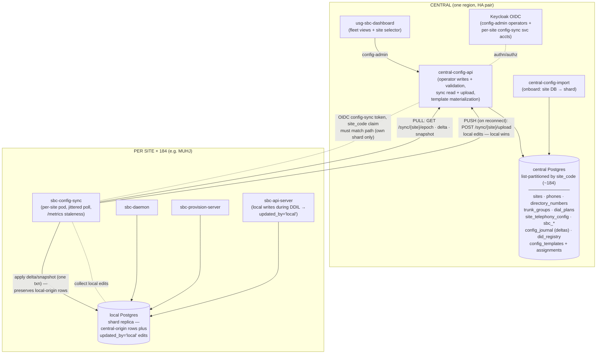
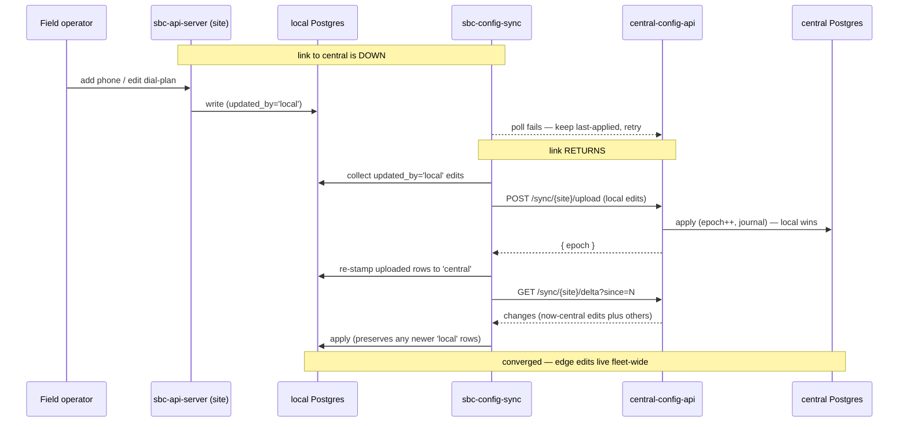

# Central Configuration Database — Design & Implementation Plan

**Status:** Draft
**Scope:** Central source of truth for phone and SBC telephony configuration
(phones, directory numbers, trunk groups, dial plans, site telephony settings)
across ~184 sites, with distributed read capability at each site.

---

## 1. Goals and non-goals

### Goals

- One authoritative, audited place to manage telephony configuration for the
  whole fleet, sharded by site code (e.g. `MUHJ`, `MPLS`, `OOPL`).
- Every site continues to provision phones, route calls, and register trunks
  with **zero dependency on WAN connectivity** for the read path
  (DDIL-tolerant: last-known-good config survives a partition of days).
- Fleet-wide visibility: "which sites are on dial plan rev N", "which phones
  run firmware X", config-staleness-by-site dashboards.
- Minimal change to the per-site SBC stack: the daemon, provision-server,
  api-server, and trunk-agent already read the in-cluster Postgres; they keep
  doing exactly that.

### Non-goals

- Distributed writes. Sites do not normally write config; the central system
  is the single writer (with a break-glass exception, §7).
- Replacing Helm for infrastructure identity. Network bootstrap config (LB
  IPs, BGP labels, zones/interfaces, TLS secrets, K8s wiring) stays in Helm
  values. Only *telephony* configuration moves to the central DB (§3).
- A geo-distributed consensus database (CockroachDB et al.). 184 sites with
  unreliable links is the wrong fit for quorum systems; the data is small and
  read-mostly.

---

## 2. Architecture overview



Key properties:

- **Pull for reads, push for local edits.** Each site polls central for
  deltas since its last applied epoch (pull rides through flaky links, NAT,
  and re-seeds after arbitrary downtime — no replication slots). On
  reconnect it *pushes* any edits made while partitioned via `/upload`,
  which central adopts (local wins) before the site pulls — so DDIL
  autonomy is preserved, not clobbered. (Lab experience: stale AAAA records,
  internal CA, intermittent reachability — long-lived logical-replication
  connections would fight all of that.)
- **The local Postgres is the distributed read capability.** No new edge
  datastore; the existing tables become a materialized copy of that site's
  shard. Rows carry `updated_by` — `'central'` (synced) vs `'local'`
  (edited at the edge); the apply engine never overwrites a `'local'` row.
- **Site code is the security boundary.** One OIDC `config-sync` credential
  per site, its `site_code` claim pinned to one shard; a site can read and
  upload only its own rows, never another's, and never fleet templates.
  Operators use a separate `config-admin` scope for fleet-wide writes.

---

## 3. What lives where

| Config | Today | Target | Rationale |
| --- | --- | --- | --- |
| Phones (MAC, vendor, lines, template) | Site Postgres `phones` | **Central, sharded** | Core provisioning data |
| Directory numbers / DIDs | Site Postgres `directory_numbers` | **Central, sharded** | Fleet-wide number management, E.164 uniqueness checks |
| Trunk groups + trunks | Site Postgres `trunk_groups` + Helm TOML examples | **Central, sharded** + global templates (§5.4) | Most trunks (e.g. BulkVS) are fleet-shared definitions with per-site selection |
| Dial plans | Site Postgres `dial_plans` + Helm TOML | **Central, sharded** + global templates | Same: baseline plan is fleet policy, sites get overrides |
| Site telephony settings (max_calls, codec prefs, default trunk group, voicemail URI…) | Helm `sites/sbc/<site>/values.yaml` → TOML ConfigMap | **Central `site_telephony_config`** | Editable without a Helm rollout |
| Zones / interfaces / listen addrs, LB IPs, BGP label, fqdn_base | Helm values | **Stays in Helm** | Infrastructure identity; changes imply a deploy anyway |
| TLS certs, HMAC/auth secrets, Postgres DSNs | K8s Secrets | **Stays in K8s Secrets** | Never in the config DB |
| OIDC issuer/client config | Helm values | Stays in Helm (Phase ≥6 may centralize) | Tied to ICAM deployment, changes rarely |

Boundary rule of thumb: **if changing it should not require `helm upgrade`,
it belongs in the central DB.** If it describes *where the SBC lives on the
network*, it stays in Helm.

---

## 4. Central schema

### 4.1 Site registry (the shard list)

```sql
CREATE TABLE sites (
    site_code     text PRIMARY KEY,          -- 'MUHJ', 'MPLS', 'OOPL-001'…
    display_name  text NOT NULL,
    fqdn_base     text NOT NULL,             -- mirrors helm site.fqdn_base
    timezone      text NOT NULL,
    status        text NOT NULL DEFAULT 'planned',  -- planned|active|decommissioned
    config_epoch  bigint NOT NULL DEFAULT 0, -- monotonic, bumped on any write to this shard
    created_at    timestamptz NOT NULL DEFAULT now(),
    updated_at    timestamptz NOT NULL DEFAULT now()
);
```

Adding site #185 = insert a row + run the partition-DDL generator
(`deploy/central-db/scripts/gen-site-partitions.sh`, which diffs `sites`
against existing partitions and emits `CREATE TABLE … PARTITION OF …`).
Never hand-write partition DDL.

**Site-code canon:** canonical form is uppercase —
`^[A-Z][A-Z0-9-]{0,14}[A-Z0-9]$` (starts with a letter, ends with a letter
or digit so lowercased DNS derivations stay valid; A–Z, 0–9, hyphen; 2–16
chars). Examples: `MUHJ`,
`MPLS`, `OOPL-001`. The registry stores only the canonical form (enforced by
a CHECK constraint); lowercase derivations — DNS labels, helm `site.name`,
partition table names (`phones_p_oopl_001`) — are computed on demand, never
stored. Inputs are uppercased at the API boundary before lookup.

### 4.2 Sharded config tables

All four config tables share an envelope; payloads stay JSONB so the existing
Rust structs (`sbc-config/src/schema.rs`) keep working unmodified:

```sql
CREATE TABLE phones (
    site_code   text NOT NULL REFERENCES sites(site_code),
    id          text NOT NULL,
    mac_normalized text NOT NULL,
    data        jsonb NOT NULL,
    revision    bigint NOT NULL,             -- shard epoch at which this row last changed
    deleted     boolean NOT NULL DEFAULT false,  -- tombstone for delta sync
    updated_at  timestamptz NOT NULL DEFAULT now(),
    updated_by  text NOT NULL,               -- OIDC subject of the operator
    PRIMARY KEY (site_code, id)
) PARTITION BY LIST (site_code);

-- Partial: tombstoned phones must not block MAC reuse by a replacement.
CREATE UNIQUE INDEX idx_phones_site_mac_live
    ON phones (site_code, mac_normalized) WHERE NOT deleted;
```

`directory_numbers`, `trunk_groups`, `dial_plans`, the four sbc routing
tables (`sbc_partitions`, `sbc_calling_search_spaces`,
`sbc_route_patterns`, `sbc_route_lists`), and `site_telephony_config`
follow the same shape (same envelope columns, existing payload formats).

Fleet-wide DID uniqueness cannot be a unique index on `directory_numbers`
itself — Postgres requires unique constraints on a partitioned table to
include the partition key. Instead, an unpartitioned `did_registry (did
PRIMARY KEY, site_code)` table is maintained by the central API in the same
transaction as every `directory_numbers` write; the primary key turns a DID
collision between two sites into a hard error.

### 4.3 Change journal (drives delta sync + audit)

```sql
CREATE TABLE config_journal (
    site_code   text NOT NULL,
    epoch       bigint NOT NULL,             -- per-site monotonic
    table_name  text NOT NULL,               -- 'phones' | 'dial_plans' | …
    row_id      text NOT NULL,
    op          text NOT NULL,               -- 'upsert' | 'delete'
    payload     jsonb,                       -- full row at this epoch (upsert)
    actor       text NOT NULL,
    at          timestamptz NOT NULL DEFAULT now(),
    -- epoch is per-transaction, not per-row: a bulk write journals N
    -- entries under one epoch, so the PK extends to (table_name, row_id).
    PRIMARY KEY (site_code, epoch, table_name, row_id)
) PARTITION BY LIST (site_code);
```

Every write transaction: bump `sites.config_epoch`, stamp the row's
`revision`, append journal entries — one transaction, so epoch order is
consistent. The journal is also the audit log (who changed what, when).
Retention: keep journal forever (it's tiny); sync falls back to full-shard
snapshot if a site is further behind than any pruned horizon.

---

## 5. Sync protocol

### 5.1 Endpoints (central-config-api)

```text
GET /v1/sync/{site_code}/epoch
    → { "epoch": 4012 }                      # cheap staleness probe

GET /v1/sync/{site_code}/delta?since={epoch}   # since defaults to 0
    → { "kind": "delta", "from": 3990, "to": 4012,
        "changes": [ {epoch, table, row_id, op, payload?}… ] }
    → { "kind": "must_snapshot", "current": 4012 }
          when `since` is ahead of the shard (client regressed); re-snapshot

GET /v1/sync/{site_code}/snapshot
    → { "epoch": 4012, "tables": [ {table, rows: [{id, payload}…]}… ] }

POST /v1/sync/{site_code}/upload          # DDIL reconcile (local → central)
    body: { "changes": [ {table, id, op, payload?}… ] }
    → { "epoch": 4015, "applied": 3 }
        adopts edits the site made while partitioned; local wins
```

The three reads return HTTP 200; the delta outcomes carry a `kind`-tagged
body (`delta` to apply, or `must_snapshot` when the client's `since`
exceeds the current epoch — the journal is retained indefinitely, so a
delta never falls off a lower horizon). `upload` is authorized by the
**same** site-scoped check as the reads, so a base can adopt changes only
into its own shard. Implemented by
[`central-config-api`](../crates/sbc/central-config-api), over the
[`central-config-store`](../crates/sbc/central-config-store) transactional
layer.

Auth (implemented): per-site service account — OIDC client-credentials
against Keycloak (`usg-uc-site-sync` client, one credential per site,
carrying a `site_code` claim and the `config-sync` scope). The API
validates the token against the issuer/audience via the shared `proto-jwt`
validator and requires `claims.site_code == {site_code}` in the path — a
401 on a bad/missing/expired token, 403 on a wrong-scope or wrong-site
token. (mTLS with internal-CA client certs remains an alternative.) Token
claim must match the path
`{site_code}` or 403. Recommend OIDC since Keycloak and JWKS validation
already exist in the stack (`proto-jwt`).

### 5.2 Edge agent: `sbc-config-sync` (implemented)

Lives in [`crates/sbc/sbc-config-sync`](../crates/sbc/sbc-config-sync); one
pod per base.

- Polls `/epoch` on an interval (default 60s ± a per-site jitter derived
  from the site code, so 184 agents don't stampede in lockstep; the probe
  is one tiny row).
- On change: fetch delta, apply to local Postgres **in one transaction**
  (the apply engine), recording the applied epoch in the local `sync_state`
  table within that same transaction.
- Fresh install / `must_snapshot` directive / regressed local epoch → full
  snapshot (whole-shard replace), then resume deltas.
- Crash-safe and idempotent: re-applying a delta is harmless (upserts +
  tombstones keyed by row id); applied rows are stamped
  `updated_by = 'central'`, and the apply engine **never overwrites a
  `updated_by = 'local'` row** (`... WHERE updated_by <> 'local'` on every
  upsert/tombstone, and snapshot reload deletes only central-origin rows).
- **DDIL reconcile (each cycle, before pulling):** collect local edits
  (`updated_by = 'local'` rows — live → upsert, tombstoned → delete), push
  them to `/upload`; on adoption, re-stamp them `'central'` with the
  returned epoch so they converge and aren't re-uploaded. Pulling only
  *after* the upload means a delta/snapshot can't clobber an edit central
  hasn't seen yet. Local wins.
- A `/metrics` endpoint (`applied_epoch`, `central_epoch`,
  `staleness_epochs`, `last_success_timestamp_seconds`, `reconcile_total`,
  `errors_total`) plus `/healthz` + `/readyz` for central staleness
  dashboards.
- Exercised end-to-end in tests via an in-process `ConfigSource` over the
  real `CentralConfigStore`: snapshot bootstrap, incremental deltas,
  tombstones, regression recovery, and the full DDIL round trip (edit at
  the edge during a partition → upload on reconnect → central adopts →
  converges, with central's own concurrent change still pulled down).

- After a successful apply the agent does a **best-effort daemon refresh**:
  it pokes the daemon's per-entity sync RPCs (`TrunkSync` / `DialPlanSync` /
  `DidMappingSync` / `SbcSync` — the same hooks `sbc-api-server` uses) for
  the changed entities, so dial-plan / trunk / routing changes take effect
  without a daemon restart. RPC failures are logged, never fatal (Postgres
  is the source of truth; the daemon also replays on startup). Enabled by
  `SYNC_DAEMON_GRPC_URL`; phones and site-config have no live router and are
  skipped.
- Auth is OIDC **client-credentials** (`SYNC_OIDC_*`): the agent exchanges
  a per-site client id/secret for an access token and refreshes it ahead of
  expiry, so Keycloak secret rotation needs no pod restart. A static
  `SYNC_BEARER_TOKEN` is still accepted for break-glass / tests.

### 5.3 Failure behavior

| Failure | Behavior |
| --- | --- |
| WAN down | Site serves last-applied config indefinitely; phones provision, calls route. Staleness metric climbs centrally. |
| Local edits during the outage (DDIL) | The site writes locally (`updated_by = 'local'`); the apply engine preserves those rows. On reconnect they're uploaded to central (local wins) and converge. |
| Central DB down | Same as WAN down for all sites; central writes blocked (acceptable — operator actions), site reads/edits continue. |
| Site Postgres lost | Sync agent detects empty `sync_state` → snapshot restore. Recovery = minutes, no central coordination. (Uncommitted local-only edits are lost with the DB — same as any single-node loss.) |
| Partial delta/upload apply | Impossible by construction (single transaction each; `/upload` is idempotent on re-send). |

### 5.4 Global templates with per-site overlay

Trunk groups and dial plans are mostly fleet policy (one BulkVS trunk-group
definition, one baseline dial plan with `911` exact-match, `+1` prefix
routing) with small per-site deviations. Model this **centrally only**:

- `global_trunk_groups` / `global_dial_plans` tables (not sharded) hold the
  fleet baseline.
- A site's effective config = global rows assigned to it (via a
  `site_assignments` table) merged with site-local overrides, **materialized
  at write time into the site's shard** by the central API.

The edge never sees the template machinery — it receives plain, fully
resolved `trunk_groups` / `dial_plans` rows exactly as today. Editing a
global template re-materializes every assigned site's shard (bumping each
epoch), which the journal handles naturally and lets you do staged rollout
(materialize to a canary site list first; §8).

---

## 6. Write path

- All writes go through `central-config-api`'s operator surface
  (`POST /v1/sites`, `POST|DELETE /v1/sites/{site}/{phones|directory|
  trunkgroups|dialplans}`, `POST|DELETE /v1/sites/{site}/routing/{kind}`
  for the four SBC routing entities, `PUT /v1/sites/{site}/config`) —
  **implemented**, each driving one transactional store write (epoch +
  revision + journal), attributed to the token subject.
- Operator authz is a second OIDC scope, `config-admin`, validated by a
  separate validator sharing the same issuer/JWKS as the sync validator —
  so a site's `config-sync` pull token can never write and an operator
  token can never masquerade as a site agent. (Per-site operator scoping
  like `config-admin:MUHJ` and the dashboard site-selector/fleet views
  remain to wire up.)
- Validation moved central: trunk-group and dial-plan payloads are parsed
  against the typed `sbc-config` schemas (`TrunkGroupConfig`,
  `DialPlanConfig`) before commit — the JSONB pass-through finally gets
  enforcement at one choke point. (The four SBC routing entities are JSON
  pass-through with no typed schema — same as the per-site api-server — so
  their routes require only an `id`.)
- **Done:** the `usg-sbc-dashboard` SPA now manages config through the
  central API (site-scoped, with a site selector); runtime views
  (registrations, CDRs, system, users) stay on the per-site `sbc-api`. The
  per-site `sbc-api-server` keeps a config write path **on purpose** — it
  is how a site edits its own config during a partition (§7); those writes
  are marked `updated_by = 'local'` and reconciled upward, rather than being
  forbidden.
- **Single sign-on:** `sbc-api-server` now also accepts the operator's
  `config-admin` OIDC token (env `SBC_OIDC_ISSUER`/`SBC_OIDC_AUDIENCE`,
  Helm `sbcApi.oidc`), alongside its legacy cookie/HMAC login. The
  dashboard authenticates once (OIDC) and uses one token for both the
  central config API and every site's runtime API — the earlier dual-auth
  interim is resolved.

---

## 7. DDIL autonomy: local edits during a partition (implemented)

A site cut off from central for hours or days must still be able to change
its own config — add a phone at a forward node, fix a dial-plan entry — and
have those changes **stick** rather than be wiped when the link returns.
The chosen policy is *local wins and syncs up*: the edge is authoritative
for its own shard during the outage, and its edits propagate to central on
reconnect (where they flow back out, now central-origin, and onward to the
fleet if applicable).

How it works (no separate "override mode" — it's the normal write path):

- The site writes to its local Postgres through the existing
  `sbc-api-server`. Site-local writes are stamped `updated_by = 'local'`,
  `revision = 0`, distinguishing them from synced rows (`'central'`).
- The sync agent's apply engine **never overwrites a `'local'` row**: every
  delta upsert/tombstone carries `... WHERE updated_by <> 'local'`, and a
  snapshot reload deletes only central-origin rows. So central traffic for
  *other* rows still applies, but the edge's own edits survive.
- Each reconcile cycle, **before** pulling, the agent collects the
  `'local'` rows and `POST`s them to `/v1/sync/{site}/upload` (authorized by
  the site's own `config-sync` token — own shard only). Central adopts them
  through the normal transactional path (epoch + revision + journal), so
  they become central-origin and a conflicting central edit is overwritten
  (local wins). The agent then re-stamps the uploaded rows `'central'`
  locally so they converge and aren't re-sent.



Edge cases handled: a fresh local edit made *during* the upload keeps its
`'local'` marker (re-stamp only flips rows still local) and is sent next
cycle; a re-sent upload is idempotent (delete of an already-absent row is a
no-op); losing the site Postgres entirely loses only uncommitted local-only
edits, same as any single-node failure (recovery is a snapshot restore).

**Not yet built:** an operator *review/approval* gate before central adopts
a site's upload. Today adoption is automatic (local wins outright). If a
deployment wants human reconciliation for certain entities, that becomes a
"proposed changes" queue on the upload endpoint — a natural extension of
the same mechanism.

---

## 8. Staged rollout of config changes (fleet safety)

Because materialization is per-site, fleet-wide changes get rings for free:

1. Edit a global template → materialize to **ring 0** (lab: OOPL) only.
2. Verify via staleness/health dashboards + trunk-agent OPTIONS health.
3. Promote to ring 1 (a handful of sites), then fleet.
4. Rollback = re-materialize the previous template revision (journal retains
   every epoch's payloads).

---

## 9. Implementation phases

> **Status (build-out complete for the core).** The end-to-end spine is
> implemented and Postgres-tested: a config write at the center
> (`central-config-api` operator surface) flows through the transactional
> store (`central-config-store`: epoch + revision + journal) and is pulled
> and applied at each site by `sbc-config-sync` into the site-local
> Postgres the SBC daemon reads. Crates: `central-config-store`
> (transactional layer, sync reads, templates), `central-config-api`
> (sync, operator HTTP, dual-scope OIDC), `sbc-config-sync` (pull/apply
> agent, metrics),
> `central-config-import` (onboarding), plus the `sbc-config-store` Phase-0
> envelope. **DDIL autonomy (§7) is implemented**: sites edit their own
> config while partitioned (`updated_by='local'`), the apply engine
> preserves those rows, and they upload to central on reconnect (local
> wins) and converge — covered by an end-to-end round-trip test. The agent
> also refreshes the daemon over gRPC after each apply and authenticates
> via OIDC client-credentials with token refresh. Deploy:
> `deploy/helm/central-config`, the `sbc` chart's `sbcConfigSync`
> component, and `deploy/keycloak/central-config-clients.md`. Remaining:
> production HA-Postgres wiring and an optional
> operator-approval gate on uploads.

### Phase 0 — Foundations (no behavior change)

- Real SQL migrations (sqlx migrate) replacing inline `CREATE TABLE IF NOT
  EXISTS`; add envelope columns (`site_code`, `revision`, `deleted`,
  `updated_by`) to existing table definitions, defaulted so current
  single-site stacks keep working.
- `sites` registry table + partition-DDL generator script.
- Decide & document site-code canon (uppercase, charset, length) — it's a PK
  and a path segment everywhere.

### Phase 1 — Central stack

- Stand up central Postgres (HA: Patroni/CNPG pair + WAL archiving to object
  storage; this is the one DB that must not lose data). **Implemented** —
  the `central-config` chart has `postgres.mode: bundled|cnpg|external`; the
  `cnpg` mode declares a CloudNativePG `Cluster` (primary + replicas,
  automatic failover, optional Barman/PITR object-store backup). The store
  runs a read/write split: writes, migrations, `epoch`/`delta`, and operator
  reads go to the primary (`-rw`); the heavy `snapshot` fan-out read is
  served from a replica (`-ro`) via `CENTRAL_POSTGRES_RO_URL`. Routing keeps
  `epoch`/`delta` on the primary so replica lag can't trigger spurious
  `MustSnapshot`, and the client always resumes deltas from the primary, so
  a lagging snapshot can never make a site miss a change.
- New `central-config-api` service (reuses `sbc-config-store` +
  `sbc-api-server` code, adds partition-aware stores, journal writes, sync
  endpoints, OIDC site-scoped authz).
- Keycloak: `usg-uc-site-sync` client + per-site credentials; operator roles.
- Importer: ingest each site's existing Postgres dump + Helm TOML
  (`trunk_groups`, `dial_plans` sections) into its shard.

### Phase 2 — Sync agent

- New crate `sbc-config-sync` + container `usg-sbc-config-sync` (follows the
  `usg-` naming convention) + Helm template; `sync_state` table local-side.
- Snapshot + delta apply + daemon gRPC refresh + metrics. **Implemented**
  (see §5.2).
- Soak in lab (OOPL): kill WAN, kill local PG, verify snapshot recovery and
  refresh behavior.

### Phase 3 — Write-path cutover

- Dashboard → central API; site api-server config writes flipped read-only.
- Central validation against typed schemas; journal/audit live.
- Global templates + materialization + site assignments.

### Phase 4 — Fleet rollout

- Onboard sites in rings: register site → import its data → deploy sync
  agent via `helm upgrade` → verify epoch convergence → flip local writes
  off. Per-site onboarding is one runbook page; bulk it with the existing
  deploy tooling.
- Staleness dashboard + alerting (site > N hours behind, sync errors).

### Phase 5 — Hardening & extensions

- Break-glass override mode (§7) for designated sites.
- Firmware/template artifact management (phone firmware blobs in object
  storage, referenced by config rows; sync agent pre-fetches per-site).
- Optional: move OIDC/client-config values central; usg-dora DHCP reservations
  generated from `phones` shard.

---

## 10. Risks & mitigations

| Risk | Mitigation |
| --- | --- |
| Central DB is a single point of failure for *writes* | HA pair + PITR backups; reads at sites unaffected by central outage |
| 184 sites polling | `/epoch` probe is one indexed row; 184 req/min is negligible; jittered intervals |
| Journal/main-table drift | Journal rows written in the same transaction as the mutation; nightly checker compares shard hash vs replayed journal |
| Site clock skew | Protocol uses epochs, never wall-clock |
| A bad fleet-wide dial-plan push | Ring-based materialization (§8); rollback = previous epoch payloads |
| Site credential compromise | Credential is read-only and scoped to one shard; revoke in Keycloak |
| JSONB payload divergence between central validation and daemon parsing | Both sides use the same `sbc-config` crate structs; CI round-trip test |
