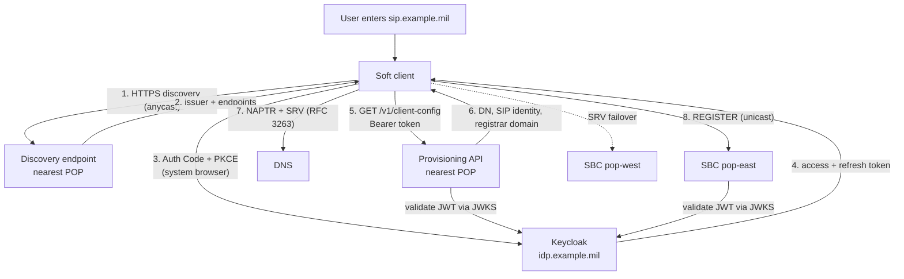
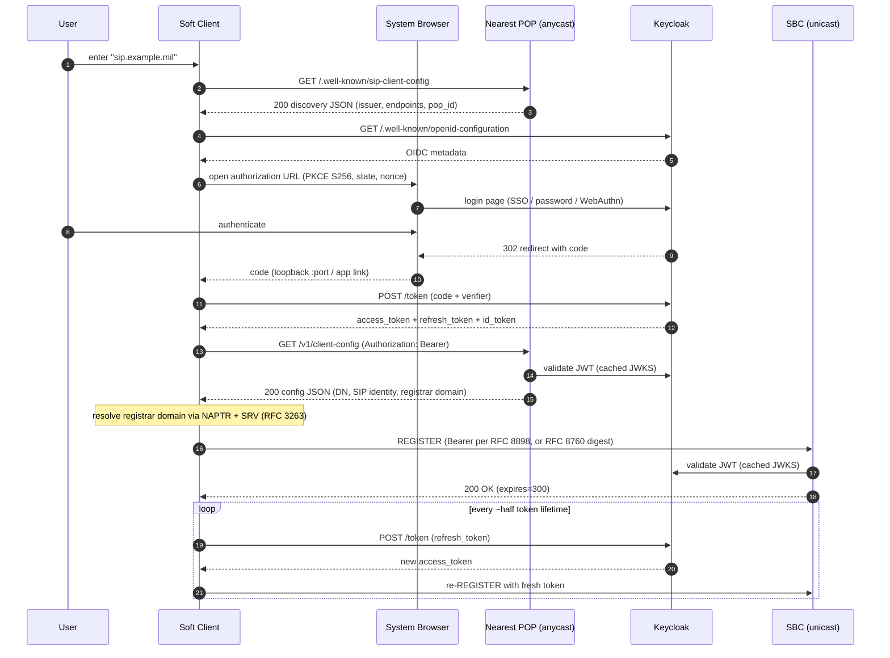
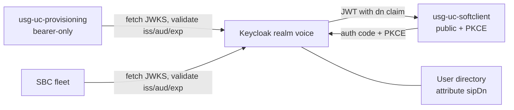
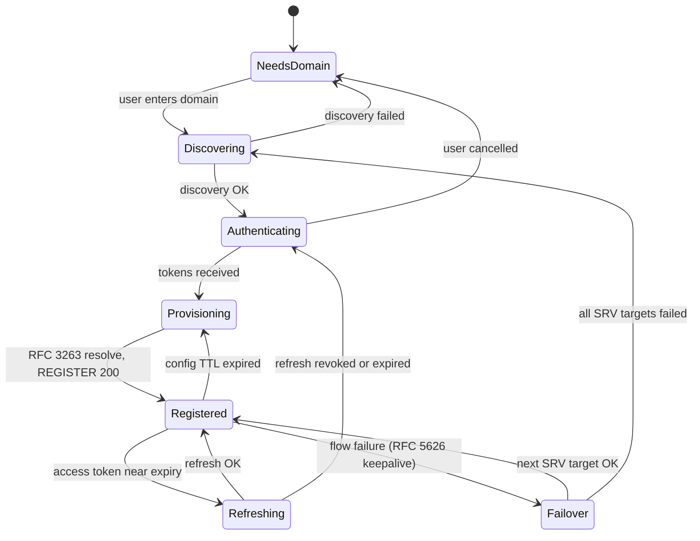

# Client Provisioning & OIDC Sign-In Design

Status: **Draft / proposal**
Scope: Desktop (Tauri) and Android soft clients, SBC fleet, Keycloak IdP.

## Goal

A user installs the soft client, types a single value — the service domain
(`sip.example.mil`) — and everything else is automatic:

1. The client discovers the nearest POP via the anycast/GeoDNS address.
2. The POP points the client at the IdP (Keycloak).
3. The user authenticates in the **system browser** (OIDC Authorization Code + PKCE, RFC 8252).
4. The client fetches its per-user configuration (DN, SIP identity, registrar domain) with the bearer token.
5. The client REGISTERs to its assigned unicast SBC.

No SIP password is ever typed. No per-device provisioning files.

## Architecture Overview



Key routing decision: **anycast for first contact, unicast for registration.**
The discovery/config responses are served from the POP the anycast route
landed on; that POP returns its own **POP-scoped registrar domain**. The
client resolves it per RFC 3263 (NAPTR for transport, SRV for targets), which
yields the POP's unicast SBCs first and a backup POP at lower SRV priority —
the long-lived SIP/TLS connection is never exposed to BGP route flaps, and
transport selection plus failover order live in DNS, not in client config.

## Sign-In Sequence



Token-expiry edge case: if the refresh token is revoked or the Keycloak SSO
session ends, the client drops to the `signed_out` state and re-runs the
browser flow. Active calls are not torn down — only re-REGISTER fails.

## Endpoint 1: Discovery

`GET https://sip.example.mil/.well-known/sip-client-config`

- Served on the anycast VIP, TLS required, no auth.
- Cacheable (`Cache-Control: max-age=300`) — contents are per-POP but stable.
- This is the only URL the client ever constructs from user input.

### Discovery example

```json
{
  "schema_version": 1,
  "service_name": "Example Voice",
  "pop_id": "us-east-1",
  "oidc": {
    "issuer": "https://idp.example.mil/realms/voice",
    "client_id": "usg-uc-softclient",
    "scopes": ["openid", "profile", "offline_access", "sip"]
  },
  "provisioning": {
    "config_endpoint": "https://us-east-1.pop.example.mil/v1/client-config"
  },
  "minimum_client_version": {
    "desktop": "0.5.0",
    "android": "0.2.0"
  }
}
```

### Discovery JSON Schema

```json
{
  "$schema": "https://json-schema.org/draft/2020-12/schema",
  "$id": "https://sip.example.mil/schemas/discovery.v1.json",
  "title": "SIP Client Discovery Document",
  "type": "object",
  "required": ["schema_version", "pop_id", "oidc", "provisioning"],
  "properties": {
    "schema_version": { "type": "integer", "const": 1 },
    "service_name": { "type": "string" },
    "pop_id": { "type": "string" },
    "oidc": {
      "type": "object",
      "required": ["issuer", "client_id", "scopes"],
      "properties": {
        "issuer": { "type": "string", "format": "uri" },
        "client_id": { "type": "string" },
        "scopes": { "type": "array", "items": { "type": "string" } }
      }
    },
    "provisioning": {
      "type": "object",
      "required": ["config_endpoint"],
      "properties": {
        "config_endpoint": { "type": "string", "format": "uri" }
      }
    },
    "minimum_client_version": {
      "type": "object",
      "additionalProperties": { "type": "string" }
    }
  }
}
```

Notes:

- `issuer` is the OIDC issuer; the client fetches
  `{issuer}/.well-known/openid-configuration` from there — we never hardcode
  Keycloak paths in the client.
- The client MUST verify that the discovery document's `issuer` host is under
  the same registrable domain as the entered service domain, or matches an
  allowlist pinned at build time. This prevents a compromised POP from
  redirecting auth to an attacker IdP.

## Endpoint 2: Client Config (provisioning)

`GET https://{pop}/v1/client-config`
`Authorization: Bearer <access_token>`

- Requires a valid JWT from the `voice` realm with the `sip` scope.
- The provisioning service maps `sub` (or `preferred_username`) to the user's
  directory entry and returns everything the SIP UA needs.
- `Cache-Control: no-store` — contains identity material.

### Config example

```json
{
  "schema_version": 1,
  "user": {
    "display_name": "Jane Doe",
    "email": "jdoe@example.mil"
  },
  "sip": {
    "uri": "sip:1456055067@example.mil",
    "dn": "1456055067",
    "extension": "5067",
    "domain": "example.mil",
    "auth": {
      "mode": "bearer",
      "digest": null
    }
  },
  "registration": {
    "expires_seconds": 300,
    "registrar_domain": "us-east-1.reg.example.mil"
  },
  "media": {
    "codecs": ["opus", "pcmu", "pcma"],
    "dtmf": "rfc4733",
    "srtp": "none"
  },
  "features": {
    "voicemail_uri": "sip:*97@example.mil",
    "mwi": true
  },
  "ttl_seconds": 3600
}
```

When `sip.auth.mode` is `"ephemeral-digest"`, the `digest` object is populated
instead:

```json
"auth": {
  "mode": "ephemeral-digest",
  "digest": {
    "username": "1456055067",
    "password": "tGq9...one-time...",
    "realm": "example.mil",
    "expires_at": "2026-06-11T19:30:00Z"
  }
}
```

### Config JSON Schema

```json
{
  "$schema": "https://json-schema.org/draft/2020-12/schema",
  "$id": "https://sip.example.mil/schemas/client-config.v1.json",
  "title": "SIP Client Configuration",
  "type": "object",
  "required": ["schema_version", "sip", "registration", "ttl_seconds"],
  "properties": {
    "schema_version": { "type": "integer", "const": 1 },
    "user": {
      "type": "object",
      "properties": {
        "display_name": { "type": "string" },
        "email": { "type": "string", "format": "email" }
      }
    },
    "sip": {
      "type": "object",
      "required": ["uri", "dn", "domain", "auth"],
      "properties": {
        "uri": { "type": "string", "pattern": "^sips?:" },
        "dn": { "type": "string" },
        "extension": { "type": "string" },
        "domain": { "type": "string" },
        "auth": {
          "type": "object",
          "required": ["mode"],
          "properties": {
            "mode": { "enum": ["bearer", "ephemeral-digest"] },
            "digest": {
              "type": ["object", "null"],
              "required": ["username", "password", "realm", "expires_at"],
              "properties": {
                "username": { "type": "string" },
                "password": { "type": "string" },
                "realm": { "type": "string" },
                "expires_at": { "type": "string", "format": "date-time" }
              }
            }
          }
        }
      }
    },
    "registration": {
      "type": "object",
      "required": ["expires_seconds", "registrar_domain"],
      "properties": {
        "expires_seconds": { "type": "integer", "minimum": 60 },
        "registrar_domain": { "type": "string", "format": "hostname" }
      }
    },
    "media": {
      "type": "object",
      "properties": {
        "codecs": { "type": "array", "items": { "type": "string" } },
        "dtmf": { "enum": ["rfc4733", "inband", "info"] },
        "srtp": { "enum": ["none", "sdes", "dtls"] }
      }
    },
    "features": { "type": "object" },
    "ttl_seconds": { "type": "integer", "minimum": 60 }
  }
}
```

Notes:

- `registration.registrar_domain` is **POP-scoped** — the POP that served the
  request returns its own domain; this is the anycast-to-unicast handoff. The
  client resolves it per RFC 3263, so transport selection and failover order
  come from DNS, never from the config payload:

  ```text
  ; transport selection (NAPTR, RFC 3263)
  us-east-1.reg.example.mil.            IN NAPTR 10 50 "s" "SIPS+D2T" "" _sips._tcp.us-east-1.reg.example.mil.

  ; target selection + failover (SRV priority/weight)
  _sips._tcp.us-east-1.reg.example.mil. IN SRV 10 50  5061 sbc1.us-east-1.pop.example.mil.
  _sips._tcp.us-east-1.reg.example.mil. IN SRV 10 50  5061 sbc2.us-east-1.pop.example.mil.
  _sips._tcp.us-east-1.reg.example.mil. IN SRV 20 100 5061 sbc1.us-west-2.pop.example.mil.
  ```

  *Implementation status:* the desktop client does not resolve NAPTR/SRV
  yet — it does an A/AAAA lookup of the registrar domain (IPv6 preferred)
  with the default port derived from the URI scheme (`sips:` → 5061,
  `sip:` → 5060). See Implementation Phases below.

- Registration robustness uses SIP Outbound (RFC 5626): the Contact carries
  `reg-id` and `+sip.instance`, flows are kept alive per RFC 5626 keepalives,
  and on flow failure the client re-resolves and registers to the next SRV
  target.
- `ttl_seconds` tells the client when to re-fetch config (picks up DN changes,
  POP drains, codec policy changes) without re-authenticating.
- The two `auth.mode` values let us ship ephemeral-digest first (the existing
  digest stack extended with RFC 8760) and move to bearer (RFC 8898) later;
  the client supports both from day one. Both modes are specified in the SIP
  Authentication Profile below.

## SIP Authentication Profile

### Bearer mode (RFC 8898)

Bearer authentication applies to **all** SIP requests, not only REGISTER:

- REGISTER carries `Authorization: Bearer <access_token>`. The registrar
  validates the JWT (signature via JWKS, `iss`/`aud`/`exp`) and requires the
  To-URI user part to equal the `dn` claim.
- Out-of-dialog requests (INVITE, SUBSCRIBE, MESSAGE) proactively carry the
  current access token the same way. On `401` with
  `WWW-Authenticate: Bearer` or `407` with `Proxy-Authenticate: Bearer`, the
  client refreshes the token and retries once with `Authorization` /
  `Proxy-Authorization` respectively.
- Mid-dialog requests (re-INVITE, UPDATE, BYE) may also be challenged, so the
  client attaches its freshest valid token to every request. Established
  dialogs are **not** torn down when a token expires — enforcement is per
  transaction, so an active call survives a token rotation.
- A challenge with `error="invalid_token"` means refresh-and-retry; any other
  Bearer error parameter is terminal and drops the client to the
  `Authenticating` state.

### Digest mode (RFC 8760 mandatory)

Ephemeral-digest mode **MUST use RFC 8760 hash algorithms**:

- SBC challenges offer `algorithm=SHA-256` (optionally `SHA-512-256`); MD5
  challenges are never emitted and MD5 responses are rejected.
- RFC 3261's MD5 default does not meet this deployment's CNSA/FIPS posture
  (see [CNSA-2-COMPLIANCE.md](CNSA-2-COMPLIANCE.md)).
- Credentials remain one-time-fetch and short-lived as specified in the
  config endpoint section.

## Keycloak Setup

### Realm: `voice`

| Setting | Value | Why |
| --- | --- | --- |
| Realm name | `voice` | Issuer becomes `https://idp.example.mil/realms/voice` |
| Access token lifespan | 5 min | Matches REGISTER expiry; SBC sees fresh tokens |
| SSO session idle / max | 10 h / 24 h | One browser login per workday |
| Offline session (with `offline_access`) | 30 d idle | Mobile clients survive long idle periods |
| Refresh token rotation | enabled (revoke on reuse) | Public client hardening |
| Required actions | configure per policy (WebAuthn, OTP) | Client is agnostic — it only sees the browser |

### Client 1: `usg-uc-softclient` (the soft client)

| Setting | Value |
| --- | --- |
| Type | **Public** (no secret — it's a native app) |
| Standard flow | enabled (Authorization Code) |
| Direct access grants | **disabled** (no password grant, ever) |
| PKCE | **required**, method `S256` (set `pkce.code.challenge.method` on the client) |
| Valid redirect URIs | `http://127.0.0.1/*` (desktop loopback, RFC 8252 §7.3); `https://app.example.mil/oauth2redirect` (Android **claimed App Link** — preferred per RFC 8252 §7.2, verified via hosted `assetlinks.json`); `org.example.usguc:/oauth2redirect` (custom-scheme fallback only, RFC 8252 §7.1) |
| Web origins | none needed (not a browser app) |
| Consent | off for first-party deployment |

### Client 2: `usg-uc-provisioning` (the config API)

| Setting | Value |
| --- | --- |
| Type | Confidential, **bearer-only** usage (it never logs users in) |
| Purpose | Audience for tokens; service account for admin lookups if the directory lives in Keycloak |

### Client scope: `sip`

A dedicated client scope (default for `usg-uc-softclient`) carrying the
voice-specific claims via protocol mappers:

| Mapper | Type | Claim | Source |
| --- | --- | --- | --- |
| `sip-dn` | User Attribute | `dn` | user attribute `sipDn` (e.g. `1456055067`) |
| `sip-domain` | Hardcoded claim | `sip_domain` | `example.mil` |
| `audience` | Audience | `aud` | adds `usg-uc-provisioning` and `sbc` |

Resulting access-token payload (trimmed):

```json
{
  "iss": "https://idp.example.mil/realms/voice",
  "sub": "f3a9...",
  "aud": ["usg-uc-provisioning", "sbc"],
  "preferred_username": "jdoe",
  "dn": "1456055067",
  "sip_domain": "example.mil",
  "scope": "openid profile offline_access sip",
  "exp": 1781234567
}
```

With `dn` in the token, the **SBC can authorize REGISTER without calling the
provisioning service**: validate signature against cached JWKS, check
`iss`/`aud`/`exp`, then require that the To-URI user part equals the `dn`
claim. The provisioning API uses the same claim to build the config response.

### Trust relationships



JWKS handling on POPs: cache keys, refresh on unknown `kid`, and keep serving
with the cached set if Keycloak is briefly unreachable — IdP downtime must not
take down re-registration. (With ephemeral-digest mode, IdP downtime only
blocks *new* sign-ins, which is another argument for shipping it first.)

## Client State Machine



Persisted across restarts (OS keystore — Keychain on macOS, Android
Keystore): the service domain, refresh token, and last-known config. On
launch the client goes straight to `Refreshing` and is registered in one
round trip — no browser unless the refresh token is dead.

## Security Considerations

- **System browser only** (RFC 8252). Embedded webviews are forbidden: they
  break SSO/WebAuthn and expose credentials to the app.
- **Issuer pinning.** Discovery is the trust bootstrap; constrain the issuer
  to the entered domain's registrable domain or a built-in allowlist.
- **No `password` grant.** Direct access grants stay disabled even though
  they would be "easier" — they bypass MFA and train users to type IdP
  passwords into native apps.
- **Refresh token storage** in the OS keystore, never plaintext config files.
- **Ephemeral digest credentials** are one-time-fetch, short-lived (≤ token
  lifetime), and `no-store`; the SBC's credential table is fed by the
  provisioning service, not a static subscriber database. Digest exchanges
  use SHA-256 per RFC 8760 — MD5 is rejected.
- **Claimed HTTPS redirects** on Android (App Links) prevent another app from
  registering the redirect and intercepting the authorization code; the
  custom scheme exists only as a fallback for builds that cannot host
  `assetlinks.json`.
- **Logout** = revoke refresh token at Keycloak + un-REGISTER + wipe keystore
  entries.

## Implementation Phases

1. **Provisioning service** — implemented:
   `crates/sbc/sbc-client-config-server` (axum pod, `sbc-<name>-server`
   conventions). Serves `/.well-known/sip-client-config` +
   `/v1/client-config` with JWT validation via the IdP's JWKS (cached,
   kid-rotation refresh, stale-serve on IdP outage). Stateless: identity
   comes from token claims (`dn`, `sip_domain`), policy from
   `SBC_CLIENT_CONFIG_*` env. Bearer mode only so far — ephemeral-digest
   minting and a directory-backed user store are follow-ups. Deploy:
   `deploy/helm/sbc/templates/21-sbc-client-config.yaml`
   (`sbcClientConfig.*` values, disabled by default) +
   per-POP image `crates/sbc/sbc-client-config-server/Dockerfile`.
2. **Client sign-in flow** — implemented: browser PKCE sign-in + loopback
   listener in the Tauri backend (`client-gui-tauri/src/signin.rs`),
   keychain-persisted refresh token, and auto-provisioning via
   `client-provisioning` (config → `SipAccount`, `auth_mode = Bearer`).
   Registration runs over SIP-over-TLS: the UA derives the default port
   from the registrar URI scheme (`sips:` → 5061), presents the registrar
   domain as SNI, and trusts the provisioning extra-CA file for SIP TLS in
   private-CA environments. **Still pending:** RFC 3263 NAPTR/SRV
   resolution (the UA currently does A/AAAA lookup of the registrar
   domain, preferring IPv6) and RFC 5626 outbound (reg-id, instance-id,
   keepalives) — until those land, transport selection comes from the
   provisioned account, not DNS.
3. **Keycloak**: `voice` realm, two clients, `sip` scope and mappers as above.
4. **Bearer SIP auth (RFC 8898)** — implemented for REGISTER on both sides:
   the client attaches `Authorization: Bearer` and reacts to 401 rejection
   with a token refresh + re-register; the SBC validates the JWT against
   the IdP JWKS and challenges with `WWW-Authenticate: Bearer` /
   `error="invalid_token"` (`proto-registrar`, `SBC_AUTH_MODE=bearer`).
   Mid-dialog request authorization and ephemeral-digest retirement are
   follow-ups.
